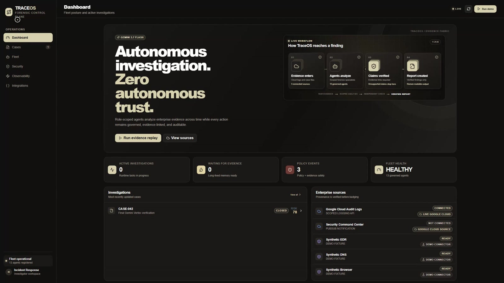
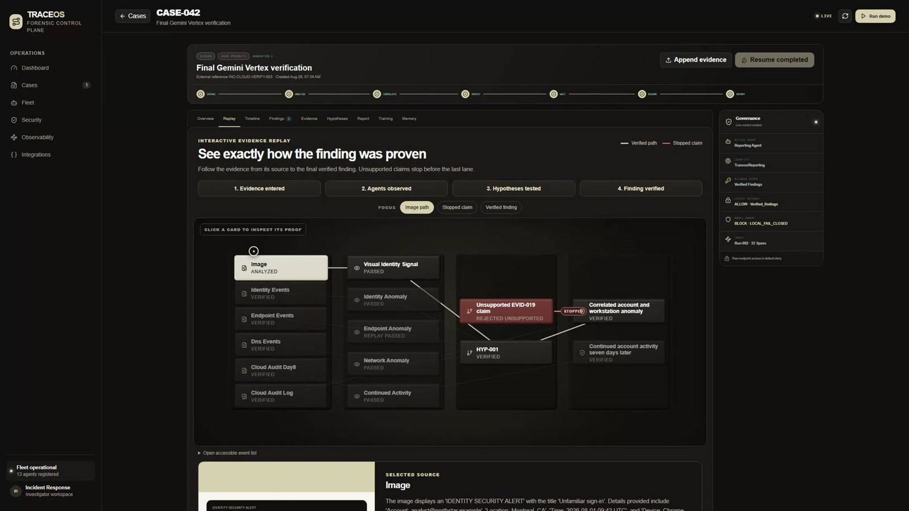
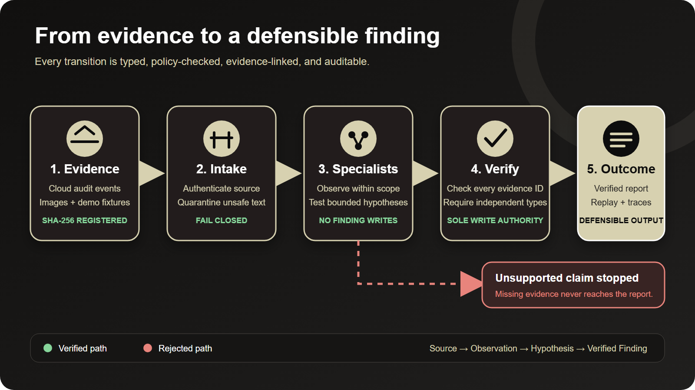
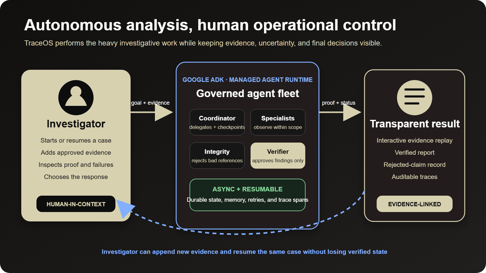
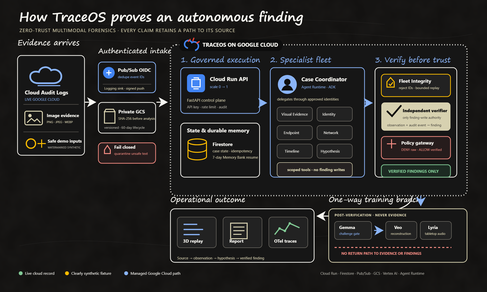
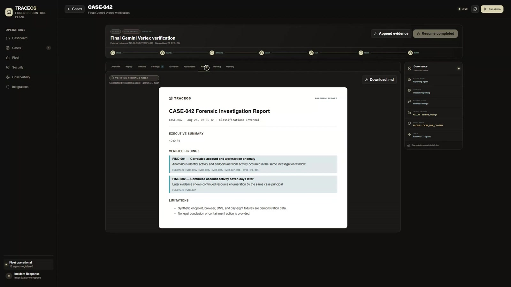
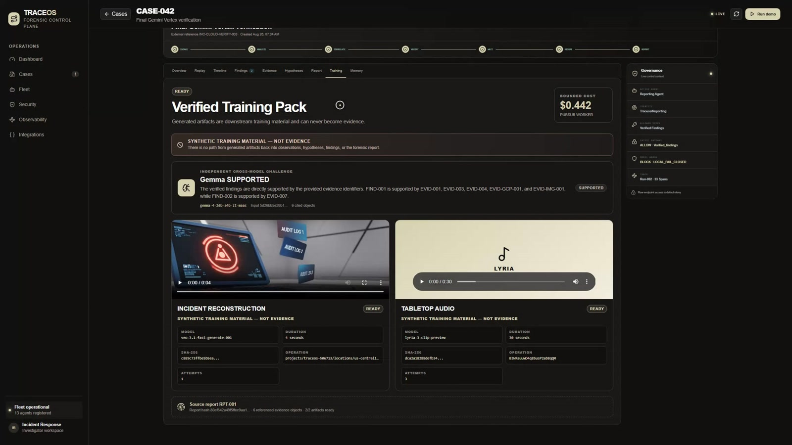
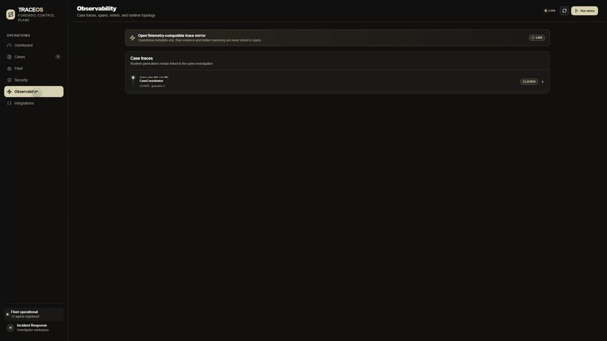
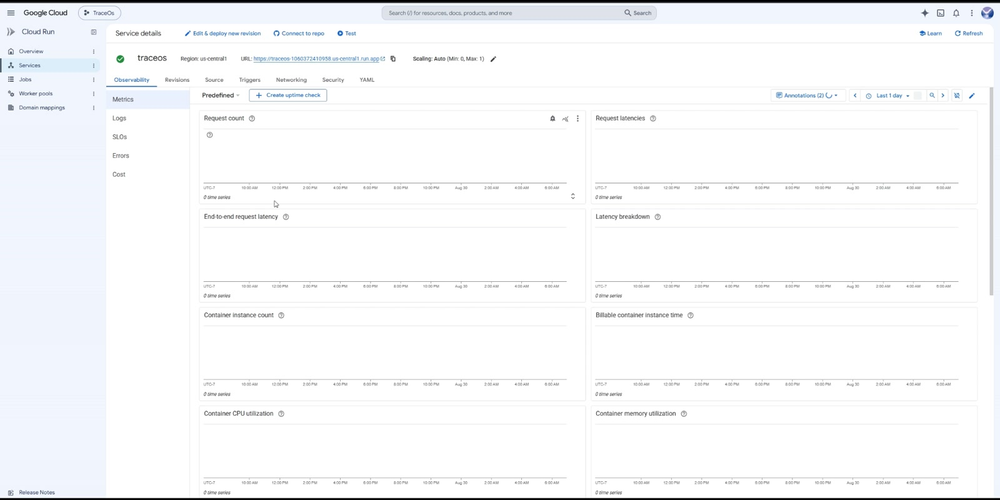
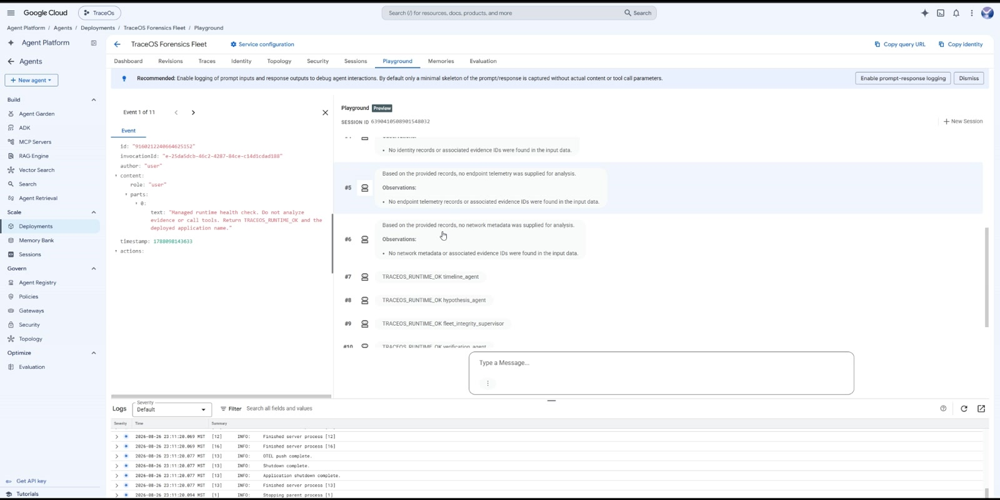

# TraceOS

**Zero-trust AI agents that investigate enterprise incidents, verify every claim, and turn evidence into defensible findings.**

## License

TraceOS is released under the [MIT License](LICENSE). Third-party frameworks and libraries retain their respective licenses; the principal dependencies are listed under [Technology stack](#technology-stack).

## What TraceOS is about

TraceOS is an autonomous, multimodal forensic control plane built for the **Fortified Enterprise Fleet** track. An investigator starts a case or supplies later evidence; a governed Google ADK fleet then inventories evidence, delegates scoped analysis, tests hypotheses, rejects unsupported references, independently verifies supported claims, preserves state across days, and produces an evidence-linked report.

It is not a prompt wrapper. The system runs asynchronously, applies typed boundaries between agents, persists durable case memory, records failures and policy decisions, and exposes exactly how a source became—or failed to become—a verified finding.

[](https://traceos-1060372410958.us-central1.run.app)

## Judge testing

The fastest evaluation path takes about three minutes and requires no account or credentials.

1. Open the [live TraceOS console](https://traceos-1060372410958.us-central1.run.app).
2. Click **Run evidence replay**. Open `CASE-042`, then select **Replay**.
3. Follow **Image → Visual Identity Signal → HYP-001 → Correlated account and workstation anomaly**.
4. Select the red `EVID-019` claim and confirm that it stops before the verified-finding lane because its evidence reference does not exist.
5. Open **Memory** to see a resumed case with verified facts and the resolved day-eight question.
6. Open **Report** to confirm that only verified findings are included.
7. Open **Training** to inspect the Gemma challenge and the isolated Veo/Lyria training artifacts marked **NOT EVIDENCE**.
8. Open **Integrations**, **Security**, and **Observability** to inspect provenance, honest connection states, policies, retries, and trace spans.

| Judge check | Direct proof | Expected result |
|---|---|---|
| Hosted backend | [Health endpoint](https://traceos-1060372410958.us-central1.run.app/api/v1/healthz) | `{"status":"ok","service":"traceos-api"}` |
| Evidence replay API | [CASE-042 replay](https://traceos-1060372410958.us-central1.run.app/api/v1/cases/CASE-042/replay) | Ordered source, observation, hypothesis, rejection, and finding events |
| Live versus synthetic provenance | [Integration status](https://traceos-1060372410958.us-central1.run.app/api/v1/integrations) | Cloud Audit Logs `CONNECTED`; fixtures marked `DEMO_SYNTHETIC`; SCC `NOT_CONNECTED` |
| Required and bonus models | [Model status](https://traceos-1060372410958.us-central1.run.app/api/v1/system/model-integrations) | Gemini 3.7 Flash active; Gemma, Veo, and Lyria invocation evidence retained |
| Security claims | [Security controls](https://traceos-1060372410958.us-central1.run.app/api/v1/system/security-controls) | Gateway `CONFIGURED`, Model Armor `LOCAL_FALLBACK`, SCC `NOT_CONNECTED` |
| Reproducibility | [Local spin-up](#run-locally) | Clean setup instructions for Docker or separate backend/frontend development |
| Cloud deployment | [Cloud Run deployment](#deploy-to-google-cloud) | Scale-to-zero Cloud Run service with Firestore, Pub/Sub, GCS, Logging, and Vertex AI |

### Required hackathon technology proof

| Requirement | TraceOS implementation | Repository evidence |
|---|---|---|
| Gemini 3.5 or newer | Gemini 3.7 Flash generates the verified report; the managed ADK runtime uses Gemini 3.5 Flash | [Model integration endpoint](https://traceos-1060372410958.us-central1.run.app/api/v1/system/model-integrations), [deployment script](scripts/deploy-cloud-run.ps1), [ADK entry point](backend/agents/agent.py) |
| Google agent framework | Google Agent Development Kit with one coordinator and ten managed forensic specialists | [ADK entry point](backend/agents/agent.py) |
| Google Cloud infrastructure | Cloud Run, Firestore, Pub/Sub, Cloud Storage, Cloud Logging, and Vertex AI | [Terraform](infra/main.tf), [deployment script](scripts/deploy-cloud-run.ps1), [evidence manifest](docs/submission_evidence/README.md) |
| Architecture diagram | Repository-hosted 2000 × 1200 PNG plus editable SVG | [PNG](docs/architecture.png), [SVG](docs/architecture.svg) |
| Reproducible README | Docker and local development paths, tests, API checks, and cloud deployment | [Run locally](#run-locally), [Verification](#verification), [Deploy](#deploy-to-google-cloud) |

## What the canonical investigation proves

`CASE-042` demonstrates one complete, inspectable enterprise workflow:

- a public action returns `202 Accepted` while the investigation continues asynchronously;
- 13 versioned agent manifests expose identity, model, tools, scope, and deployment state;
- evidence is registered with SHA-256 hashes and append-only custody events;
- image text and case notes are treated as untrusted data rather than instructions;
- visual, identity, endpoint, and network agents produce observations only;
- Fleet Integrity rejects nonexistent `EVID-019` and performs one bounded replay using registered evidence;
- only Independent Verification can move `HYP-001` into a verified finding;
- the Reporting Agent is denied raw endpoint evidence and recovers through its `verified_findings` scope;
- Firestore-backed state resumes the same case seven days later without losing verified facts;
- Cloud Audit events preserve authenticated source metadata and external event identifiers;
- the final report, replay, and trace tree retain evidence links and governance outcomes;
- post-verification Gemma, Veo, and Lyria outputs remain in a one-way training plane that cannot write evidence or findings.

[](https://traceos-1060372410958.us-central1.run.app)

## Investigation flow



The editable source for this diagram is [docs/readme/investigation-flow.svg](docs/readme/investigation-flow.svg). A claim cannot skip a lane: specialists write observations, hypotheses cite registered evidence, and the verifier is the only component with finding-write authority.

## Human and agent collaboration



The investigator controls the case objective, approved evidence, and operational response. The agent fleet performs bounded analysis in the background and returns a transparent replay, verified report, rejection record, and audit trail. When new evidence arrives, the investigator can append it and resume the same case instead of restarting or losing prior verified state. The editable diagram is [docs/readme/human-agent-collaboration.svg](docs/readme/human-agent-collaboration.svg).

## Architecture



The deployable product is a single Cloud Run container: Next.js is statically exported and served by FastAPI. Cloud Run scales from zero to one instance for the public demo. Firestore holds durable case and integration state; signed Pub/Sub push delivers Cloud Audit events; private, versioned Cloud Storage keeps image evidence and generated training media separated; Vertex AI provides Gemini and the optional post-verification models; and OpenTelemetry-compatible spans expose operational metadata without storing raw evidence or hidden reasoning.

The managed agent deployment is a distinct Gemini Enterprise Agent Platform resource in `northamerica-northeast1`. It packages one ADK coordinator and ten evidence-bounded specialists with Agent Identity and runtime telemetry. The application control plane remains in `us-central1` so browser/API traffic, persistence, and managed agent execution can fail independently.

Editable architecture source: [docs/architecture.svg](docs/architecture.svg).

## Product tour

<table>
  <tr>
    <td width="50%"></td>
    <td width="50%"></td>
  </tr>
  <tr>
    <td><strong>Verified report.</strong> Reporting receives verified findings and the approved timeline—not unrestricted raw evidence.</td>
    <td><strong>One-way training branch.</strong> Gemma challenges the report before Veo or Lyria may produce clearly labeled non-evidence material.</td>
  </tr>
</table>



### Google Cloud deployment proof

<table>
  <tr>
    <td width="50%"></td>
    <td width="50%"></td>
  </tr>
  <tr>
    <td><strong>Cloud Run.</strong> The public FastAPI and Next.js application runs in `us-central1` with minimum instances set to zero and maximum instances set to one.</td>
    <td><strong>Gemini Enterprise Agent Platform.</strong> The managed ADK fleet responds to the runtime health request in the Agent Runtime Playground.</td>
  </tr>
</table>

## Agent fleet

| Agent | Identity | Allowed responsibility |
|---|---|---|
| Case Coordinator | `traceos/case-coordinator` | Registry resolution, delegation, checkpoints, and case memory |
| Evidence Intake | `traceos/evidence-intake` | Registration, hashing, source validation, and safety inspection |
| Visual Evidence | `traceos/visual-evidence` | OCR and directly observable image facts only |
| Identity Analysis | `traceos/identity-analysis` | Identity evidence observations |
| Endpoint Analysis | `traceos/endpoint-analysis` | Supplied endpoint telemetry observations |
| Network Analysis | `traceos/network-analysis` | Supplied DNS and network metadata observations |
| Timeline Correlation | `traceos/timeline` | Ordering approved observations by event time |
| Hypothesis | `traceos/hypothesis` | Falsifiable, evidence-linked hypotheses and missing-evidence criteria |
| Fleet Integrity | `traceos/fleet-integrity` | Evidence-reference validation and one bounded replay |
| Independent Verification | `traceos/verification` | Verification decisions and verified-memory writes |
| Forensic Reporting | `traceos/reporting` | Reports from verified findings and the approved timeline |
| Cross-model Verification | `traceos/cross-model-verification` | Gemma challenge using verified statements and evidence IDs only |
| Training Pack | `traceos/training-pack` | Redacted report input and isolated synthetic training outputs |

No agent has shell access, malware execution, credential cracking, exploit execution, or endpoint-control tools.

## Security and governance

- **Immutable originals:** transformations create derived records; original evidence is not modified.
- **Default-deny scopes:** identities, tools, data scopes, and output types are declared in agent manifests.
- **No observation-to-finding shortcut:** worker agents cannot write verified facts or reports.
- **Evidence is untrusted data:** content cannot select agent identities, policies, tools, or outcomes.
- **Provenance enforcement:** synthetic records cannot set `live_source_verified=true`; this is validated and tested.
- **Authenticated ingestion:** Pub/Sub push validates OIDC audience and identity, preserves event IDs, and deduplicates redelivery.
- **Private storage:** evidence and training buckets use public-access prevention, uniform access, versioning, and 60-day lifecycle rules.
- **Bounded public demo:** the public action uses a cached, watermarked synthetic image, accepts no arbitrary file, and is rate limited.
- **Protected mutations:** generic upload, resume, ingestion, and training-generation routes can require `TRACEOS_API_KEY`.
- **Trace privacy:** spans contain operational metadata, policies, latency, and errors—not raw evidence or hidden model reasoning.
- **One-way media isolation:** generated training video/audio has no method or data path back into evidence, observations, hypotheses, findings, or reports.
- **Cost controls:** Cloud Run scales to zero; demo starts are capped; model outputs are bounded and cached; one training pack has a `$1` circuit breaker and the project remains under the `$5` hosting limit.

### Honest control status

| Control | Current status | Claim boundary |
|---|---|---|
| Agent Runtime + Agent Identity | `VERIFIED` | Managed regional runtime, health response, identity, and telemetry captured |
| Agent Gateway resource | `CONFIGURED` | Resource exists; no managed authorization-policy deny/allow claim is made |
| Application policy gateway | `ACTIVE` | Demonstrates raw-evidence deny and verified-findings allow inside TraceOS |
| Model Armor | `LOCAL_FALLBACK` | Template creation was denied in the project; no managed Model Armor claim is made |
| Security Command Center | `NOT_CONNECTED` | Connector route exists, but source notification authentication is not verified |

## Technology stack

| Layer | Technology |
|---|---|
| Web console | Next.js 16, React 19, TypeScript, Lucide, React Three Fiber, Three.js |
| API and orchestration | Python 3.12, FastAPI, Pydantic, Google ADK |
| Models | Gemini 3.7 Flash, Gemini 3.5 Flash, supplemental Gemini 2.5 Flash vision, Gemma 4, Veo 3.1, Lyria 3 |
| Google Cloud | Cloud Run, Vertex AI, Gemini Enterprise Agent Platform, Firestore, Pub/Sub, Cloud Storage, Cloud Logging |
| Observability | OpenTelemetry API and SDK |
| Local development | SQLite with the same typed application state model |
| Infrastructure | Terraform, Cloud Build, PowerShell deployment automation |

## Data sources

| Source | Provenance label | Purpose |
|---|---|---|
| Authenticated Google Cloud Audit Logs | `GOOGLE_CLOUD_LIVE` | Real cloud-event ingestion and provenance verification |
| Watermarked sign-in image | `DEMO_SYNTHETIC` | Safe multimodal OCR and visual-observation demonstration |
| Identity, browser, endpoint, DNS, and day-eight fixtures | `DEMO_SYNTHETIC` | Deterministic, non-sensitive golden-path evidence |

The repository contains no private enterprise records. Reserved example identities, `.invalid` domains, documentation IP ranges, and visibly watermarked imagery prevent demo data from being mistaken for production evidence.

## Run locally

### Option A: Docker

Prerequisites: Docker Desktop or another Docker Engine.

```bash
cp .env.example .env
# Set GOOGLE_API_KEY in .env for local Gemini API access.
docker build -t traceos .
docker run --rm --env-file .env -p 8080:8080 traceos
```

Open `http://localhost:8080`. API documentation is at `http://localhost:8080/docs`.

### Option B: backend and frontend development

Prerequisites: Node.js 20+, Python 3.11+, and npm.

```bash
cp .env.example .env
python -m venv .venv
```

Activate the environment:

```bash
# macOS / Linux
source .venv/bin/activate

# Windows PowerShell
.\.venv\Scripts\Activate.ps1
```

Install dependencies:

```bash
python -m pip install -r backend/requirements-runtime.txt
npm --prefix frontend install
```

Run the backend in terminal one:

```bash
python -m uvicorn app.main:app --app-dir backend --reload --port 8000
```

Run the frontend in terminal two:

```bash
npm --prefix frontend run dev
```

Open `http://localhost:3000`. API documentation is at `http://localhost:8000/docs`.

Windows users can run `./scripts/run-local.ps1` after creating `.env`; it launches both development processes.

### Minimum local configuration

```dotenv
GOOGLE_API_KEY=replace-with-your-local-key
GEMINI_MODEL=gemini-3.6-flash
GEMINI_VISION_MODEL=gemini-3.5-flash
GEMINI_USE_VERTEX=false
TRACEOS_STORE=sqlite
TRACEOS_DB_PATH=./data/traceos.db
```

Never commit `.env`, API keys, service-account files, or downloaded cloud credentials. Cloud Run uses its service identity and Vertex AI; no Gemini API key is deployed.

## API verification

Start or reopen the idempotent public demo:

```bash
curl -X POST http://localhost:8000/api/v1/demo/start
```

Inspect the ordered evidence replay:

```bash
curl http://localhost:8000/api/v1/cases/CASE-042/replay
```

Stream operational updates:

```bash
curl -N http://localhost:8000/api/v1/cases/CASE-042/stream
```

Append the deterministic day-eight event and resume the saved case:

```bash
curl -X POST http://localhost:8000/api/v1/demo/day-eight
```

Inspect provenance and model state:

```bash
curl http://localhost:8000/api/v1/integrations
curl http://localhost:8000/api/v1/system/model-integrations
curl http://localhost:8000/api/v1/system/security-controls
```

Generic evidence uploads and private training generation require `X-TraceOS-API-Key` when `TRACEOS_API_KEY` is configured. The bounded `/demo/start` action intentionally needs no key and accepts no arbitrary payload.

## Verification

Run the backend suite:

```bash
python -m pytest backend/tests -q
```

Run frontend verification:

```bash
npm --prefix frontend run build
npm --prefix frontend run typecheck
npm --prefix frontend test
npm --prefix frontend audit --omit=dev
```

The test suite covers image type, size, dimensions, hashing, idempotency, schema validation, failed model responses, verifier-only finding writes, replay ordering, rejected claims, missing images, OIDC rejection, duplicate audit delivery, event-ID preservation, saved-state resume, and 20 consecutive deterministic golden runs.

## Deploy to Google Cloud

Prerequisites: an authenticated Google Cloud CLI, a project with billing enabled, and permission to enable APIs and create the listed resources.

```powershell
.\scripts\deploy-cloud-run.ps1 -ProjectId YOUR_PROJECT_ID -Region us-central1
```

The deployment automation:

1. enables the required Cloud Run, Cloud Build, Firestore, Logging, Vertex AI, Pub/Sub, Storage, Secret Manager, and Model Armor APIs;
2. creates a dedicated runtime service account and grants scoped roles;
3. creates private evidence and training buckets with versioning and lifecycle rules;
4. creates or reuses a Firestore Native database;
5. deploys one `min-instances=0`, `max-instances=1`, 1-vCPU, 512-MiB Cloud Run service;
6. configures authenticated Cloud Audit ingestion through Logging, Pub/Sub, and OIDC push;
7. configures an API-key secret for private write routes;
8. keeps Gemma, Veo, and Lyria invocation disabled by default so deployment cannot trigger model cost.

Production-shaped Terraform is in [infra/main.tf](infra/main.tf). Detailed setup and resource verification commands are in [docs/cloud-setup.md](docs/cloud-setup.md) and [docs/submission_evidence/README.md](docs/submission_evidence/README.md).

## Bonus-model isolation

After Independent Verification completes, TraceOS can create one cached training pack:

1. Gemma receives verified statements and evidence identifiers, then independently returns `SUPPORTED` or a disagreement.
2. A disagreement stops the branch.
3. A supported report may be transformed into a Veo incident reconstruction and a Lyria tabletop exercise.
4. Outputs are hashed, privately stored, labeled synthetic training material, and blocked from returning to the forensic plane.

The verified `CASE-042` pack cost ledger is `$0.442`: Gemma `$0.002`, Veo `$0.320`, and Lyria `$0.120`. The public deployment keeps all three adapters disabled after the cached proof run.

## Failure handling and recovery

| Failure | Safe behavior | Recovery |
|---|---|---|
| Prompt injection inside evidence | Quarantine unsafe text; keep the original registered | Continue with unaffected evidence |
| Missing evidence reference | Reject the claim before verification | One bounded replay using the case evidence index |
| Reporting requests raw endpoint data | Default-deny policy decision is recorded | Read verified findings and approved timeline instead |
| Gemini image analysis fails | Show `ANALYSIS_FAILED`; do not create a fallback observation | Retry only through a protected administrative path |
| Duplicate Pub/Sub delivery | Deduplicate by preserved source event ID | Return an idempotent result |
| Process restart or later evidence | Reload durable case state and verified memory | Resume the same case generation |
| Optional media generation fails | Preserve the failure and keep forensic outputs complete | Retry only the isolated training job within its cap |

## Project structure

```text
backend/app/       FastAPI API, policies, persistence, cloud connectors, replay, training
backend/agents/    Google ADK managed Agent Runtime entry point
backend/tests/     unit, API, security, replay, and golden-path tests
frontend/          Next.js operator console and accessible 3D/2D evidence replay
infra/             Terraform, lifecycle, and Google Cloud resource definitions
scripts/           local launch, deployment, ingestion, secret, and worker automation
docs/              architecture, cloud setup, demo guidance, and proof manifest
docs/readme/       repository-hosted diagrams and product/proof screenshots
data/evidence/     clearly watermarked synthetic image used by the bounded demo
```

## Findings and engineering lessons

- **Verification must be a capability boundary, not a prompt request.** Separating observation, hypothesis, and finding writes makes unsupported conclusions mechanically harder to publish.
- **Provenance is a product feature.** The interface must distinguish authenticated cloud events from synthetic fixtures everywhere, not only in logs.
- **Persistent state needs explicit semantics.** Checkpoints, idempotency keys, generation numbers, verified-memory writes, and append-only custody events matter more than merely storing a chat history.
- **Failures improve trust when they remain visible.** The rejected claim, denied raw-evidence request, unsuccessful optional-model attempts, and unavailable managed controls are retained instead of hidden.
- **Generated media belongs downstream of verification.** The one-way training branch adds multimodal utility without contaminating the evidence plane.

## Known limitations

- The managed Agent Gateway resource is configured, but a managed authorization policy and live managed deny/allow proof were unavailable; TraceOS therefore labels the application policy gateway separately.
- The project identity was denied permission to create a Model Armor template. The live app reports `LOCAL_FALLBACK` and does not claim managed Model Armor enforcement.
- Security Command Center is intentionally `NOT_CONNECTED` until deployment-level notification authentication can be verified.
- Synthetic identity, endpoint, DNS, browser, text, image, and day-eight data demonstrate behavior without exposing enterprise records.
- The 3D replay uses a keyboard-accessible 2D timeline on reduced-motion, small-screen, or WebGL-unavailable clients.
- The preferred KH-Inference-TRIAL font is not distributed because no licensed font file was supplied; the interface uses the configured local preference with system fallbacks.

## Hackathon submission and asset disclosure

- **Category:** Fortified Enterprise Fleet.
- **Creation period:** the first repository commit is dated August 26, 2026, within the official August 4–31, 2026 submission period.
- **Required stack:** Gemini 3.5 or newer, Google ADK, and Google Cloud infrastructure are implemented and linked above.
- **Repository assets:** every screenshot and diagram displayed in this README is committed under `docs/`; screenshots depict TraceOS or its Google Cloud deployment.
- **Evidence imagery:** `EVID-IMG-001` is synthetic, visibly watermarked, and safe to publish.
- **Third-party assets:** no external dashboard reference image is redistributed. Open-source packages are installed from the declared Python and npm manifests and retain their own licenses.
- **Architecture:** a judge-uploadable PNG is available at [docs/architecture.png](docs/architecture.png).
- **Demo:** the repository includes the [demo script](docs/demo-script.md) and [runbook](docs/demo-runbook.md). The final public YouTube or Vimeo URL should remain in the Devpost entry so judges receive the required approximately four-minute video and Google Cloud backend proof.
- **Official rules:** the [Devpost event requirements](https://allthingsagentichackathon.devpost.com/) and [official rules](https://allthingsagentichackathon.devpost.com/rules) prevail if any repository description differs.

The public application, API responses, screenshots, diagrams, source code, resource identifiers, and limitations are aligned so every material claim can be independently checked.
